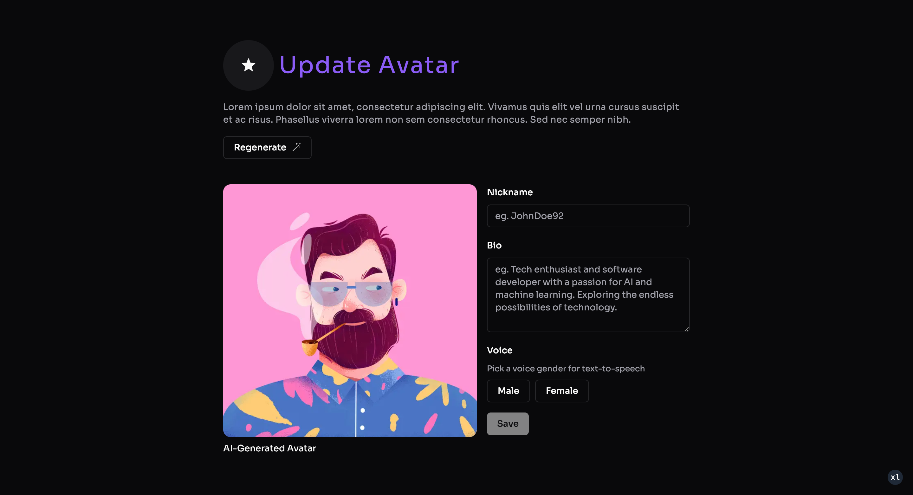

# Smart India Hackathon 2023

> Disclaimer: This project is still under development. The final product may differ from the current version. This project does not follow any best practices and is not optimized for production.

---

### About

**Topic**
- SIH1330

**Problem Statement**
- Text to Video of various PIB Press Releases using Artificial Intelligence / Machine Learning / Generative Adversarial Networks in English and 13 Regional Languages viz. Hindi, Urdu, Punjabi, Gujarati, Marathi, Telugu, Kannada, Malayalam, Tamil, Odia, Bengali, Assamese and Manipuri.

**Organization**
- Ministry of Information and Broadcasting

**Domain Bucket**
- Smart Automation

---

### Team Members

- [Hitesh Meta](https://github.com/hiteshmeta85)
- [Om Surve](https://github.com/gamingflexer)
- [Shreya Belanekar](https://github.com/ShreyaMBelanekar42)
- [Kunal Wagh](https://github.com/kunalwagh30092002)
- [Yash Wakekar](https://github.com/Yash-Wakekar)
- [Tanshiq Parkar](https://github.com/RevTpark)

---

## Getting Started

Node Version:
> 18.13.0

First, install the required packages:

```bash
pnpm install
```

Then, configure the .env file:

> Check the .env.example file

Then, run the development server:

```bash
pnpm dev
```

Open [http://localhost:3000](http://localhost:3000) with your browser to see the result.

---

## Technologies Used

1. [Next.js](https://nextjs.org/)
2. [TypeScript](https://www.typescriptlang.org/)
3. [Tailwind CSS](https://tailwindcss.com/)
4. [Shadcn/ui](https://ui.shadcn.com/)
5. [Radix UI](https://www.radix-ui.com/)
6. [React-Hook-Form](https://react-hook-form.com/)
7. [Zod](https://zod.dev/)
8. [Prettier](https://prettier.io/)
9. [ESLint](https://eslint.org/)
10. [Axios](https://axios-http.com/)

---

## Demo Images

1. Home Page


2. Video Showcase


3. Avatar Showcase


4. Individual Video Page


5. Video Generation Prompt Page


6. Language Selection Page


7. Duration Selection Page


8. Avatar Selection Page


9. Edit Avatar Page



10. Edit Script Page


11. Generation Message Page


